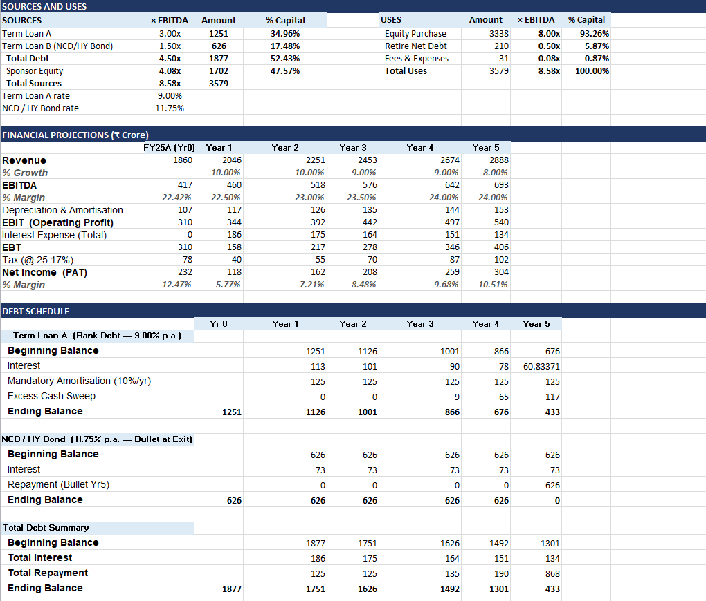
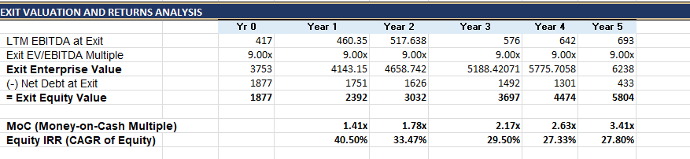

# 📊 Leveraged Buyout (LBO) Model – Gateway Distriparks Ltd.

## 🎯 Project Objective

Built a Leveraged Buyout (LBO) model to evaluate the acquisition of Gateway Distriparks Ltd. using a combination of debt and sponsor equity financing.

The model assesses transaction feasibility, debt repayment capacity, cash flow generation, and investor returns through Money-on-Money (MoM) and Internal Rate of Return (IRR) analysis.

---

## 🛠 Tools Used

- Microsoft Excel
- Financial Modeling
- Leveraged Buyout (LBO) Analysis
- Debt Modeling
- Financial Statement Forecasting
- Valuation Analysis
- Corporate Finance

---

## 📷 Project Preview

### Sources & Uses, Operating Forecast & Debt Schedule

### Exit Valuation & Investor Returns

---

## 📂 Model Structure

### Transaction Assumptions
- Entry EV/EBITDA Multiple
- Revenue & EBITDA Base
- Existing Net Debt
- Purchase Price
- Exit EV/EBITDA Multiple

### Sources & Uses
- Term Loan A
- NCD / High Yield Debt
- Sponsor Equity
- Fees & Expenses
- Total Acquisition Cost

### Operating Forecast
- Revenue Growth
- EBITDA Margin Expansion
- EBIT Forecast
- Net Income Projection

### Debt Schedule
- Interest Expense
- Mandatory Amortization
- Excess Cash Sweep
- Debt Paydown Analysis

### Leveraged Free Cash Flow (LFCF)
- Net Income
- Depreciation & Amortization
- Capital Expenditure
- Change in Net Working Capital
- Leveraged Free Cash Flow

### Exit Analysis
- Exit EBITDA
- Exit Enterprise Value
- Exit Equity Value
- Net Debt at Exit

### Returns Analysis
- Money-on-Money (MoM)
- Internal Rate of Return (IRR)

---

## 📈 Key Analysis Performed

### Transaction Structure

The acquisition is financed through a mix of:

- Senior Debt (Term Loan A)
- NCD / High Yield Debt
- Sponsor Equity

The model evaluates the impact of leverage on investor returns and overall transaction feasibility.

### Sources & Uses Analysis

A complete Sources & Uses schedule is constructed to determine:

- Equity Purchase Price
- Debt Financing Requirement
- Sponsor Equity Contribution
- Fees and Transaction Costs

### Debt Paydown Analysis

A detailed debt schedule tracks:

- Interest Payments
- Mandatory Debt Amortization
- Excess Cash Sweep
- Debt Reduction Over the Holding Period

### Leveraged Free Cash Flow (LFCF)

The model estimates cash available to investors after:

- Operating Expenses
- Interest Costs
- Capital Expenditure
- Working Capital Requirements

### Exit Valuation

Exit value is determined using:

- Exit EBITDA
- Exit EV/EBITDA Multiple
- Net Debt at Exit

The model then calculates the resulting equity value available to sponsors.

### Returns Analysis

The investment is evaluated using:

#### Money-on-Money (MoM)

Measures total value created relative to sponsor equity invested.

#### Internal Rate of Return (IRR)

Measures the annualized return generated over the investment period.

---

## 🔎 Key Insights

- Debt declines significantly from **₹1,877 Cr** at acquisition to **₹433 Cr** by Year 5.
- Revenue increases from **₹1,860 Cr** to **₹2,888 Cr** over the forecast period.
- EBITDA grows from **₹417 Cr** to **₹693 Cr**.
- Exit Equity Value expands from **₹1,877 Cr** to approximately **₹5,804 Cr**.
- Money-on-Money (MoM) reaches approximately **3.41x** by Year 5.
- Equity IRR remains above **27%**, indicating attractive private equity returns.

---

## 💼 Business Impact

This model helps:

- Evaluate private equity acquisition opportunities.
- Assess debt repayment capacity.
- Analyze transaction feasibility.
- Estimate investor returns under different scenarios.
- Support investment committee and deal-screening decisions.

---

## 🚀 Skills Demonstrated

- Leveraged Buyout (LBO) Modeling
- Financial Modeling
- Debt Schedule Modeling
- Financial Forecasting
- Sources & Uses Analysis
- Capital Structure Analysis
- Valuation
- IRR Analysis
- MoM Analysis
- Corporate Finance
- Excel Modeling

---

## 📁 Project Files

- LBO Model (Excel)
- Sources & Uses Analysis
- Operating Forecast Model
- Debt Schedule
- Leveraged Free Cash Flow Analysis
- Exit Valuation
- MoM & IRR Returns Analysis

---

## 👨‍💼 Author

**Pratha Jain**

Finance | Private Equity | Valuation | Financial Modeling | Corporate Finance
